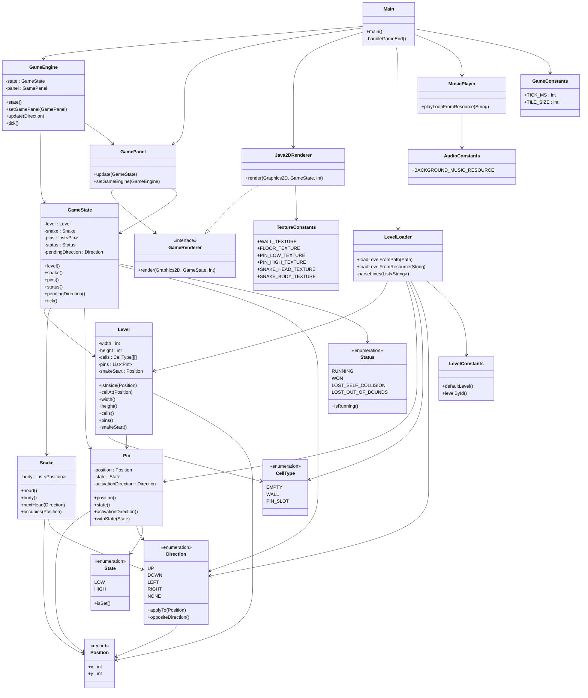

# LockSnake_prog2

## UML-Klassendiagramm

```mermaid
classDiagram

%% =========================
%% MAIN
%% =========================

class Main {
    +main()
    -handleGameEnd()
}

%% =========================
%% ENGINE / LOGIC
%% =========================

class GameEngine {
    -state : GameState
    -panel : GamePanel

    +state()
    +setGamePanel(GamePanel)
    +update(Direction)
    +tick()
}

class GameState {
    -level : Level
    -snake : Snake
    -pins : List~Pin~
    -status : Status
    -pendingDirection : Direction

    +level()
    +snake()
    +pins()
    +status()
    +pendingDirection()
    +tick()
}

class Status {
    <<enumeration>>
    RUNNING
    WON
    LOST_SELF_COLLISION
    LOST_OUT_OF_BOUNDS

    +isRunning()
}

%% =========================
%% UI
%% =========================

class GamePanel {
    +update(GameState)
    +setGameEngine(GameEngine)
}

class GameRenderer {
    <<interface>>
    +render(Graphics2D, GameState, int)
}

class Java2DRenderer {
    +render(Graphics2D, GameState, int)
}

%% =========================
%% LEVEL SYSTEM
%% =========================

class LevelLoader {
    +loadLevelFromPath(Path)
    +loadLevelFromResource(String)

    -parseLines(List~String~)
}

class Level {
    -width : int
    -height : int
    -cells : CellType[][]
    -pins : List~Pin~
    -snakeStart : Position

    +isInside(Position)
    +cellAt(Position)

    +width()
    +height()
    +cells()
    +pins()
    +snakeStart()
}

class CellType {
    <<enumeration>>
    EMPTY
    WALL
    PIN_SLOT
}

%% =========================
%% GAME OBJECTS
%% =========================

class Snake {
    -body : List~Position~

    +head()
    +body()
    +nextHead(Direction)
    +occupies(Position)
}

class Pin {
    -position : Position
    -state : State
    -activationDirection : Direction

    +position()
    +state()
    +activationDirection()
    +withState(State)
}

class State {
    <<enumeration>>
    LOW
    HIGH

    +isSet()
}

class Position {
    <<record>>
    +x : int
    +y : int
}

class Direction {
    <<enumeration>>
    UP
    DOWN
    LEFT
    RIGHT
    NONE

    +applyTo(Position)
    +oppositeDirection()
}

%% =========================
%% AUDIO
%% =========================

class MusicPlayer {
    +playLoopFromResource(String)
}

%% =========================
%% CONSTANTS
%% =========================

class GameConstants {
    +TICK_MS : int
    +TILE_SIZE : int
}

class TextureConstants {
    +WALL_TEXTURE
    +FLOOR_TEXTURE
    +PIN_LOW_TEXTURE
    +PIN_HIGH_TEXTURE
    +SNAKE_HEAD_TEXTURE
    +SNAKE_BODY_TEXTURE
}

class AudioConstants {
    +BACKGROUND_MUSIC_RESOURCE
}

class LevelConstants {
    +defaultLevel()
    +levelById()
}

%% =========================
%% RELATIONS
%% =========================

Main --> GameEngine
Main --> GamePanel
Main --> Java2DRenderer
Main --> LevelLoader
Main --> MusicPlayer

GameEngine --> GameState
GameEngine --> GamePanel

GamePanel --> GameRenderer
GamePanel --> GameState

Java2DRenderer ..|> GameRenderer

GameState --> Level
GameState --> Snake
GameState --> Pin
GameState --> Direction
GameState --> Status

Level --> CellType
Level --> Pin
Level --> Position

Snake --> Position
Snake --> Direction

Pin --> Position
Pin --> Direction
Pin --> State

Direction --> Position

LevelLoader --> Level
LevelLoader --> Pin
LevelLoader --> CellType
LevelLoader --> Direction

MusicPlayer --> AudioConstants

Java2DRenderer --> TextureConstants

Main --> GameConstants
LevelLoader --> LevelConstants
```

